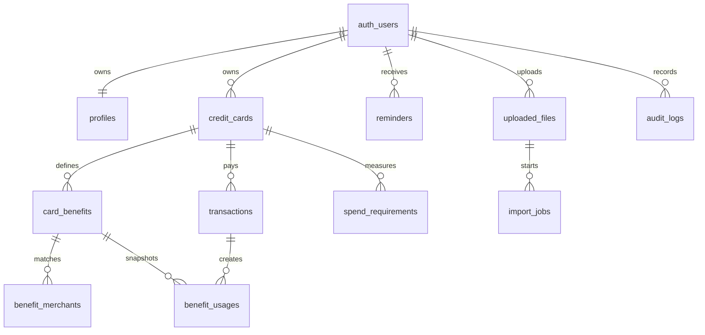

# 数据库设计

正式数据层为 Supabase PostgreSQL。所有用户数据表都直接带有 `user_id`；RLS 使用 `auth.uid()`，API 仍显式按当前用户过滤，从而形成双层 IDOR 防护。



## 关键约束

- 金额使用 `bigint` 最小货币单位，KRW 直接保存整数韩元，禁止浮点金额。
- `credit_cards.last_four` 只允许四位数字；没有完整卡号、CVC、密码、有效期或验证码字段。
- `card_benefits.rule` 是通过 Zod 校验的 JSONB 结构化规则，同时保留 `description` 面向用户展示。
- 每次权益使用保存 `rule_snapshot` 和 `benefit_name_snapshot`，规则更新不会改写历史。
- 业务表使用 `deleted_at` 软删除；常用索引均排除已删除行。
- 卡片归档/恢复通过事务型 PostgreSQL 函数处理，只恢复同一次归档的权益、交易和使用记录，并写入审计日志。
- `card_catalog` 与 `catalog_benefits` 保存审核后的公共产品及不可变权益版本；`credit_cards.catalog_snapshot` 和 `card_benefits.catalog_source_snapshot` 保存用户添加时的来源快照。
- `catalog_sync_runs` 记录幂等同步，`catalog_change_events` 与 `user_catalog_updates` 让持卡人确认新规则后再影响未来计算。
- 公共模板使用 `is_public_template=true, user_id=null`；用户自定义元数据必须有 `user_id`。
- CSV 的 `external_fingerprint` 在用户范围内唯一，用于重复检测。

基础 schema、索引、触发器、RLS 与 Storage 策略位于 `supabase/migrations/202608040001_cardwise.sql`；`202608050001_card_lifecycle.sql` 增量加入卡片币种和可恢复归档函数；`202608050002_korean_card_catalog.sql` 新增目录、版本、同步、来源文档、管理员和用户更新确认。已有环境必须按文件名顺序执行全部迁移。

首次启用管理员审核时，由项目所有者在 Supabase SQL Editor 使用已确认的 Auth 用户 UUID 执行：

```sql
insert into public.cardwise_admins(user_id) values ('真实管理员 Auth UUID');
```

普通客户端无权读取或修改 `cardwise_admins`。不要在 seed 或公开仓库中提交真实用户 UUID。
